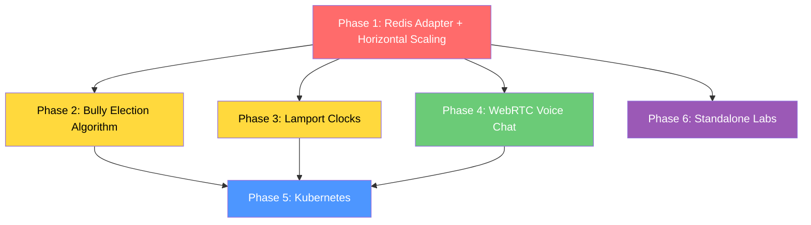

# BrainBrush v2 — Distributed Systems Mini Project Plan

Map every unit of the DS syllabus to real, working code changes in BrainBrush, while simultaneously scaling the architecture and adding voice chat.

---

## Syllabus ↔ BrainBrush Mapping (At a Glance)

| Unit | Syllabus Topic Picked | BrainBrush Implementation | Lab # Covered |
|------|----------------------|--------------------------|---------------|
| **I** | Architecture, Middleware, Scalability | Horizontal scaling: Redis Adapter + Nginx LB + multi-instance Docker Compose | Lab 6 (Mini Project) |
| **II** | Stream-Oriented Comm, P2P Messaging, WebRTC | WebRTC voice chat in rooms (peer-to-peer audio) | Lab 1 (Socket) |
| **III** | Election Algorithms + Lamport Logical Clocks | Bully Algorithm for host re-election + Lamport timestamps on drawing events | Lab 2 + Lab 4 |
| **IV** | Kubernetes, Distributed Web Systems | Kubernetes manifests + HPA auto-scaling | Lab 6 (Mini Project) |

> [!NOTE]
> **Lab 3 (Deadlock Detection)** and **Lab 5 (Hadoop Word Count)** don't map naturally to BrainBrush's domain. These are better done as standalone scripts/exercises. I'll create small self-contained demos inside a `labs/` directory for those.

---

## User Review Required

> [!IMPORTANT]
> **WebRTC Voice Chat Scope:** This is a significant feature. I plan to implement it as a **signaling server** on the backend (using existing Socket.IO) with **peer-to-peer audio** via the browser's WebRTC API. This means audio data flows directly between players (P2P), NOT through the server — which is the correct distributed systems approach AND saves bandwidth. Do you want:
> - **Option A:** Push-to-talk (simple, like Discord's walkie-talkie mode)
> - **Option B:** Always-on voice with mute toggle (like a Discord voice channel)

> [!IMPORTANT]
> **Kubernetes vs Docker Compose for Unit IV:** Your Terraform already provisions a single EC2 instance. For the college demo:
> - **Option A:** Multi-instance Docker Compose with Nginx LB (simpler, runs on your current EC2)
> - **Option B:** Full Kubernetes manifests with HPA (more impressive, but needs a K8s cluster — Minikube locally or EKS on AWS)
> - **Option C:** Both — Docker Compose for quick demo + K8s manifests as "production-ready" documentation

---

## Open Questions

> [!IMPORTANT]
> 1. **How will you demo this to the teacher?** Live on a server? Local Docker? Screen recording? This affects how much infra work we do.
> 2. **Timeline?** When is the submission deadline? This determines how many phases we tackle.
> 3. **Does the teacher expect a written report/document** mapping topics to code, or is a live demo + code sufficient?

---

## Phase 1: Horizontal Scaling — Redis Adapter + Load Balancer (Unit I)

**DS Topics Covered:** Distributed System Architecture, Middleware, Transparency (Location/Migration), Scalability, Design Issues

**Why this is the #1 priority:** Everything else (Bully election, Lamport clocks, voice chat) *requires* horizontal scaling to be meaningful. You can't demonstrate distributed algorithms on a single server.

### What Changes

#### [MODIFY] [redis.ts](file:///home/xcaliber/Projects/BrainBrush-v2/backend/src/config/redis.ts)
- Create separate `pubClient` and `subClient` Redis connections for the Socket.IO Redis Adapter (it requires two dedicated connections)
- Export both alongside the existing `redis` client

#### [MODIFY] [server.ts](file:///home/xcaliber/Projects/BrainBrush-v2/backend/src/server.ts)
- Attach `@socket.io/redis-adapter` to the Socket.IO server
- Add `INSTANCE_ID` environment variable logging so we can see which instance handles which request
- Import and wire up the pub/sub Redis clients

#### [MODIFY] [index.ts (sockets)](file:///home/xcaliber/Projects/BrainBrush-v2/backend/src/sockets/index.ts)
- **Critical fix:** Move `activeSessions` Map to Redis (`active:sessions` hash) so duplicate-session detection works across all server instances
- Currently it's an in-memory `Map<string, string>` — this breaks completely with 2+ servers

#### [MODIFY] [drawingSocket.ts](file:///home/xcaliber/Projects/BrainBrush-v2/backend/src/sockets/drawingSocket.ts)
- **Critical fix:** Move `activeDrawers` Map to Redis (`active:drawers` hash) — same problem as above
- The drawer permission check (`activeDrawers.get(roomCode) !== socket.user?.id`) must work across instances

#### [MODIFY] [gameSocket.ts](file:///home/xcaliber/Projects/BrainBrush-v2/backend/src/sockets/gameSocket.ts)
- **Critical fix:** Move `temporaryNames` Map to Redis (`player:names` hash)
- Currently if Player A registers their name on Server 1, Server 2 doesn't know about it

#### [MODIFY] [timer.ts](file:///home/xcaliber/Projects/BrainBrush-v2/backend/src/utils/timer.ts)
- **Critical fix:** Move `activeTimers` and `timeRemaining` to Redis
- Use Redis `PEXPIRE` + a per-instance polling mechanism, or a Redis-based distributed timer
- Only ONE instance should run the timer tick for a given room (distributed lock with `SET NX`)

#### [NEW] `docker-compose.scaled.yml`
- 3 backend instances (`backend-1`, `backend-2`, `backend-3`) on different ports
- 1 Redis container (local, replaces Upstash for dev)
- 1 MongoDB container (local, replaces Atlas for dev)
- 1 Nginx container as reverse proxy + WebSocket-aware load balancer

#### [NEW] `nginx/nginx.conf`
- Upstream block with `ip_hash` (sticky sessions for WebSocket upgrade)
- WebSocket proxy headers (`Upgrade`, `Connection`)
- Health check endpoints

#### [MODIFY] [package.json (backend)](file:///home/xcaliber/Projects/BrainBrush-v2/backend/package.json)
- Add `@socket.io/redis-adapter` dependency

### How to Demo to Teacher
> Start 3 backend containers. Open 3 browser tabs. Show each tab connecting to a different server instance (via logs). Create a room, have players join across instances. Draw — all players see it in real time. **This IS distributed systems.**

---

## Phase 2: Bully Election Algorithm for Host Re-election (Unit III)

**DS Topics Covered:** Election Algorithms, Coordinator Selection, Fault Tolerance

**Current Problem:** When the host disconnects in [roomService.ts](file:///home/xcaliber/Projects/BrainBrush-v2/backend/src/services/roomService.ts#L66-L74), the new host is just `players[0]` from `SMEMBERS` — which is **unordered** and arbitrary. This is NOT an election; it's random assignment.

### What Changes

#### [NEW] `backend/src/algorithms/bullyElection.ts`
- Implement the **Bully Algorithm** as a proper distributed election
- Each player has a priority (based on join order, stored as a score in a Redis Sorted Set)
- When the host disconnects:
  1. The detecting node broadcasts an `ELECTION` message to all higher-priority players
  2. If no higher-priority player responds within a timeout → the initiator declares itself `COORDINATOR`
  3. If a higher-priority player responds with `ALIVE` → that player takes over the election
  4. The winner broadcasts `COORDINATOR` to all players
- All election messages flow through Socket.IO events (`election_start`, `election_alive`, `election_coordinator`)

#### [MODIFY] [roomService.ts](file:///home/xcaliber/Projects/BrainBrush-v2/backend/src/services/roomService.ts)
- Replace `players[0]` host assignment with Bully Election trigger
- Store player priorities in Redis Sorted Set (`room:{code}:priority`)
- When a player joins, assign priority = current timestamp (higher = joined earlier = higher priority)

#### [MODIFY] [roomSocket.ts](file:///home/xcaliber/Projects/BrainBrush-v2/backend/src/sockets/roomSocket.ts)
- Add socket event handlers for `election_start`, `election_alive`, `election_coordinator`
- On `disconnecting`: if the disconnecting player was the host, trigger the Bully election
- Broadcast election results to all room members

#### [NEW] `docs/bully_election.md`
- Document with diagrams explaining how the Bully Algorithm works in BrainBrush
- Include sequence diagrams for: normal election, contested election, cascade election

### How to Demo to Teacher
> 4 players in a room. Host is Player A (highest priority). Kill Player A's connection. Watch the Bully election cascade through players B, C, D via socket events. Player B wins and becomes the new host. Show the election messages in the console/UI.

---

## Phase 3: Lamport Logical Clocks on Drawing Events (Unit III)

**DS Topics Covered:** Clock Synchronization, Logical Clocks, Lamport's Algorithm, Event Ordering, Happened-Before Relation

**Why this matters for BrainBrush:** With 3 server instances, drawing events from different players arrive at different servers. Without logical ordering, strokes can appear in the wrong order (Player A's eraser stroke arrives before the line it's erasing).

### What Changes

#### [NEW] `backend/src/algorithms/lamportClock.ts`
- `LamportClock` class with:
  - `tick()` → increment local counter (internal event)
  - `send()` → increment and return timestamp (send event)
  - `receive(remoteTimestamp)` → `max(local, remote) + 1` (receive event)
- Store per-room clock state in Redis (`room:{code}:lamport`)

#### [MODIFY] [drawingSocket.ts](file:///home/xcaliber/Projects/BrainBrush-v2/backend/src/sockets/drawingSocket.ts)
- Attach Lamport timestamp to every `draw_line_batch` event
- On receive: update local clock, reorder buffer if needed
- Clients receive events with logical timestamps and render in correct causal order

#### [MODIFY] [socketTypes.ts](file:///home/xcaliber/Projects/BrainBrush-v2/backend/src/types/socketTypes.ts)
- Add `lamportTimestamp: number` to `CanvasSegment` interface
- Add `logicalClock: number` to drawing event payloads

#### [MODIFY] Frontend `CanvasBoard.tsx`
- Display a small "Logical Clock: N" counter in dev mode / debug panel
- Order incoming segments by Lamport timestamp before rendering

#### [NEW] `docs/lamport_clocks.md`
- Document explaining Lamport's happened-before relation applied to BrainBrush
- Visual timeline showing events across 3 servers

### How to Demo to Teacher
> Show the Lamport clock counter incrementing on each drawing event. With 2 players on different servers, show that events are correctly ordered even when network delays cause out-of-order arrival. Show the debug panel with logical timestamps.

---

## Phase 4: WebRTC Voice Chat (Unit II)

**DS Topics Covered:** Stream-Oriented Communication, P2P Messaging, WebRTC, Signaling, NAT Traversal

**This directly fulfills your mic/voice feature request** while covering Unit II's most important topics.

### Architecture
```
Player A ──WebSocket──► Backend (Signaling Server) ◄──WebSocket── Player B
    │                                                        │
    └──────────── WebRTC Peer-to-Peer Audio ────────────────┘
                    (direct, no server relay)
```

### What Changes

#### [NEW] `backend/src/sockets/voiceSocket.ts`
- WebRTC signaling server using existing Socket.IO transport
- Handle `voice_join`, `voice_leave`, `voice_offer`, `voice_answer`, `voice_ice_candidate`
- Mesh topology: each player connects to every other player in the room (works for rooms up to ~6-8 players)

#### [MODIFY] [index.ts (sockets)](file:///home/xcaliber/Projects/BrainBrush-v2/backend/src/sockets/index.ts)
- Register `voiceSocket(io, socket)` handler

#### [NEW] `frontend/src/hooks/useWebRTC.ts`
- Custom React hook managing:
  - `getUserMedia()` for microphone access
  - `RTCPeerConnection` creation and lifecycle
  - ICE candidate exchange via Socket.IO signaling
  - SDP offer/answer negotiation
  - Audio stream attachment to `<audio>` elements

#### [NEW] `frontend/src/components/VoiceChat.tsx`
- UI component with:
  - Mic on/off toggle button
  - Visual indicators showing who is speaking (voice activity detection)
  - Volume level indicators
  - Speaker list with mute controls

#### [MODIFY] `frontend/src/pages/GamePage.tsx`
- Integrate `<VoiceChat />` component into the game room layout

#### [NEW] `docs/webrtc_voice.md`
- Document explaining WebRTC architecture, STUN/TURN servers, ICE candidates, SDP exchange
- How it maps to DS concepts: P2P communication, decentralized data flow, signaling vs media planes

### How to Demo to Teacher
> Two players in a room. Player A clicks "Join Voice." Player B joins voice. They can talk to each other. Show in Chrome DevTools → `chrome://webrtc-internals` that audio flows directly P2P without going through the server. **This is peer-to-peer distributed communication.**

---

## Phase 5: Kubernetes Deployment (Unit IV)

**DS Topics Covered:** Distributed Web-Based Systems, Container Orchestration, Auto-Scaling, Service Discovery

### What Changes

#### [NEW] `k8s/` directory
- `backend-deployment.yaml` — 3 replica pods for the Node.js backend
- `backend-service.yaml` — ClusterIP service for internal routing
- `frontend-deployment.yaml` — Frontend Nginx pod
- `frontend-service.yaml` — LoadBalancer service (public)
- `redis-deployment.yaml` — Single Redis pod with PersistentVolumeClaim
- `redis-service.yaml` — ClusterIP service
- `ingress.yaml` — Nginx Ingress for WebSocket routing
- `hpa.yaml` — HorizontalPodAutoscaler (scale backend 3→10 based on CPU)

#### [NEW] `docs/kubernetes.md`
- Document mapping K8s concepts to DS syllabus:
  - Pods = distributed processes
  - Services = service discovery & naming (Unit II self-study)
  - HPA = elastic scalability
  - Ingress = reverse proxy + load balancing
  - PVC = distributed storage

### How to Demo to Teacher
> Run on Minikube. `kubectl get pods` shows 3 backend replicas. Load test → watch `kubectl get hpa` auto-scale to more pods. Kill a pod → K8s auto-restarts it (fault tolerance). **This is container orchestration.**

---

## Phase 6: Standalone Lab Scripts (Labs 3 & 5)

These don't map to BrainBrush but are required by the lab syllabus.

#### [NEW] `labs/deadlock-detection/`
- Simple Node.js script simulating processes with a **Wait-For Graph**
- Detect cycles using DFS → deadlock found
- Can loosely relate to BrainBrush: "What if two rooms try to acquire the same Redis lock simultaneously?"

#### [NEW] `labs/hadoop-wordcount/`
- Classic Hadoop MapReduce word count
- Input: BrainBrush chat logs exported from MongoDB
- This creates a nice narrative tie-in: "We analyze our game's chat data at scale using Hadoop"

---

## Execution Order & Dependencies



**Phase 1 is the foundation.** Phases 2, 3, 4 can be done in parallel after Phase 1. Phase 5 wraps everything. Phase 6 is independent.

---

## Verification Plan

### Automated Tests
- `docker compose -f docker-compose.scaled.yml up` → verify 3 instances register with Redis Adapter
- Artillery load test against Nginx LB → verify events routed across instances
- Bully election unit test: simulate host disconnect, verify correct winner
- Lamport clock unit test: verify `max(local, remote) + 1` invariant

### Manual Verification
- Open 3 browser tabs → each connects to a different backend instance (verify via `INSTANCE_ID` header)
- Draw in one tab → verify strokes appear in all tabs (cross-instance broadcast)
- Kill the host's tab → verify Bully election completes and new host is assigned
- Join voice chat → verify audio flows P2P (check `chrome://webrtc-internals`)
- `kubectl get pods` → verify pod count, HPA scaling, pod restart on failure

### Documentation Deliverables
Each phase produces a `docs/` markdown file that the teacher can read:
1. `docs/architecture_ds_mapping.md` — Master document mapping DS syllabus → BrainBrush
2. `docs/bully_election.md` — Algorithm explanation + BrainBrush implementation
3. `docs/lamport_clocks.md` — Logical clocks in real-time drawing
4. `docs/webrtc_voice.md` — P2P communication architecture
5. `docs/kubernetes.md` — Container orchestration case study

---

## Summary: What the Teacher Sees

| DS Concept | Where in BrainBrush | Demo |
|-----------|---------------------|------|
| Distributed Architecture | Multi-instance backend + Redis + MongoDB + Nginx LB | 3 containers syncing in real-time |
| Middleware | Socket.IO Redis Adapter bridging server instances | Drawing events cross server boundaries |
| Message-Oriented Comm | Socket.IO events (draw, guess, chat) | Real-time game flow |
| Stream-Oriented Comm | WebRTC audio streams | Players talking in voice chat |
| P2P Communication | WebRTC peer connections (no server relay) | `chrome://webrtc-internals` proof |
| Election Algorithm | Bully algorithm for host re-election | Kill host → watch election cascade |
| Logical Clocks | Lamport timestamps on drawing events | Debug panel showing clock values |
| Mutual Exclusion | Redis distributed lock for drawer permission | Only one player can draw at a time |
| Fault Tolerance | Redis HA, graceful degradation, K8s pod restart | Kill a pod → auto-recovery |
| Container Orchestration | Kubernetes with HPA auto-scaling | `kubectl get pods` during load test |
| Scalability | 10K users across N server instances | Artillery load test results |
